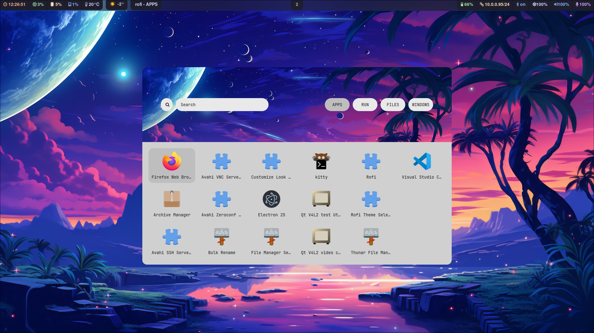
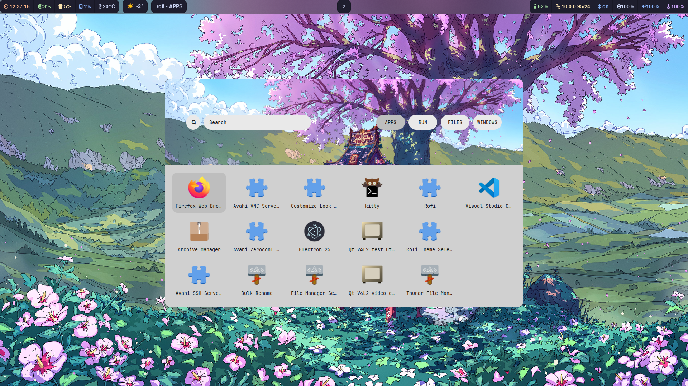

#  Hyprland Dotfiles

<p align="center">
  
  
  
  
  </p>


**NOTE: Yay must be installed 

```
git clone https://aur.archlinux.org/yay.git
cd yay
makepkg -si
```


### 🗄️ Dependencies 

```
yay -S hyprland-bin kitty waybar-hyprland \
    swaybg swaylock-effects rofi sddm-git wlogout mako thunar \
    ttf-jetbrains-mono-nerd thunar-archive-plugin file-roller noto-fonts-emoji \
    polkit-gnome python-requests swww starship \
    swappy grim slurp pamixer brightnessctl gvfs \
    bluez bluez-utils neofetch lxappearance xfce4-settings \
    dracula-gtk-theme dracula-icons-git xdg-desktop-portal-hyprland-git \
    python python-pyamdgpuinfo jq 
```

### 💻 Install

```
git clone https://github.com/T-Crypt/dots && cd dots
cp -R .config/* ~/.config/
sudo systemctl enable sddm.service
sudo systemctl start sddm.service
```

<details> 
  <summary><h2>🏷️ Additional Packages </h2></summary>

</details>


### 🐜 ScreenShots







### Changes to Make

You need to edit the wttr-in.py script to change city location

Current Location: Denver, CO

`.config/waybar/scripts/waybar-wttr.py`
