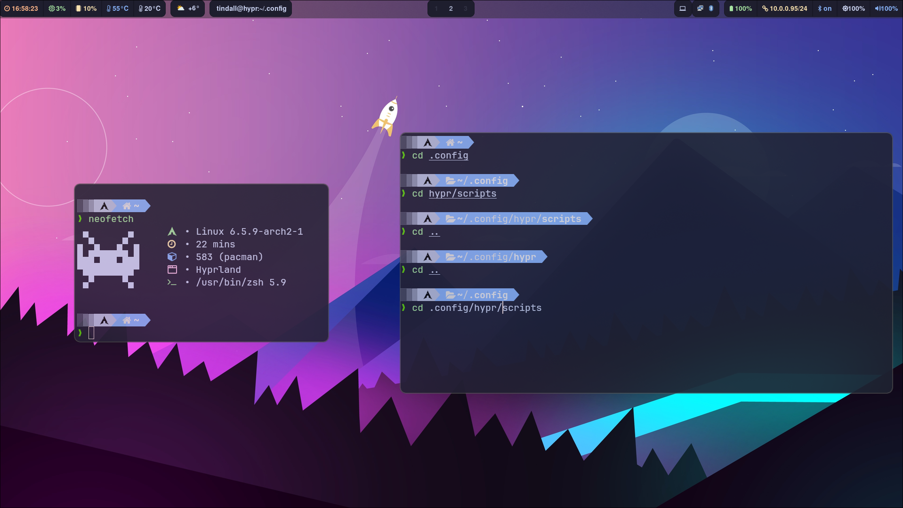
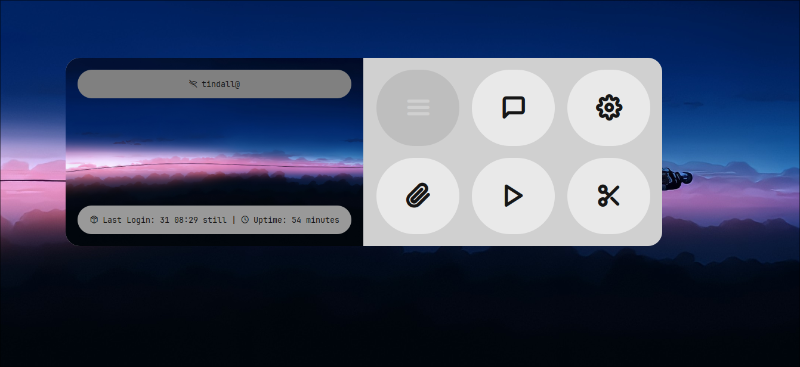

                                    Hyprland Dotfiles

<p align="center">
  
  
  
  
  </p>

* Window Manager - [Hyprland](https://github.com/hyprwm/Hyprland)
* Panel - [Waybar](https://github.com/Alexays/Waybar)
* Terminal - [Kitty](https://github.com/kovidgoyal/kitty)
* Notifications - [Mako](https://github.com/emersion/mako)
* Launcher - [Rofi](https://github.com/davatorium/rofi) with [Custom Launchers](https://github.com/adi1090x/rofi)
* File Manager - [Thunar](https://github.com/xfce-mirror/thunar)
* Shell - [ZSH](https://sourceforge.net/projects/zsh/) or [Starship](https://github.com/starship/starship)
* Wallpaper Manager - [Swww](https://github.com/Horus645/swww)

<details> 
  <summary><h2> Features </h2></summary>

- Pywall Theming
  - Rofi Themed
  - Kitty Themed
  - Waybar Themed
  - Mako Themed
  - Swaylock Themed
  - Cava Themed
  - Firefox Themed
  - VScode Themed
  - GTK Themed (Soon) 

- Thunar "Set as Theme" option for custom theming 
- SDDM Wallpaper script (Sync current wallpaper to SDDM)
</details>

### Install

```
git clone https://github.com/T-Crypt/dots && cd dots
chmod +x install.sh
./install.sh
```

You can select Y or N to install custom apps by modifying the custom_apps.lst in the root directory.

**Note: You need to install pywalfox extensions for firefox theme to work!
[Pywalfox](https://addons.mozilla.org/en-US/firefox/addon/pywalfox/)

### ScreenShots


<details> 
  <summary><h2> Additional Screenshots </h2></summary>







</details>


<details> 
  <summary><h2> KeyBindings </h2></summary>

| Keys | Action |
| :--  | :-- |
| <kbd>Super</kbd> + <kbd>Q</kbd> | quit active/focused window
| <kbd>Super</kbd> + <kbd>W</kbd> | Change Wallpaper / Change Theme
| <kbd>Super</kbd> + <kbd>T</kbd> | launch kitty terminal
| <kbd>Super</kbd> + <kbd>E</kbd> | launch Thunar
| <kbd>Super</kbd> + <kbd>C</kbd> | launch vscode
| <kbd>Super</kbd> + <kbd>F</kbd> | launch firefox
| <kbd>Super</kbd> + <kbd>A</kbd> | launch desktop applications (rofi)
| <kbd>Super</kbd> + <kbd>L</kbd> | lock screen
| <kbd>Super</kbd> + <kbd>V</kbd> | Toggle Floating
| <kbd>Super</kbd> + <kbd>J</kbd> | Toggle Split
| <kbd>Super</kbd> + <kbd>S</kbd> | Print Screen Tool
| <kbd>Super</kbd> + <kbd>backspace</kbd> | Rofi Powermenu
| <kbd>Super</kbd> + <kbd>MouseScroll</kbd> | cycle through workspaces
| <kbd>Super</kbd> + <kbd>[0-9]</kbd> | switch to workspace [0-9]
| <kbd>Super</kbd> + <kbd>Shift</kbd> + <kbd>[0-9]</kbd> | move active window to workspace [0-9]

</details>
