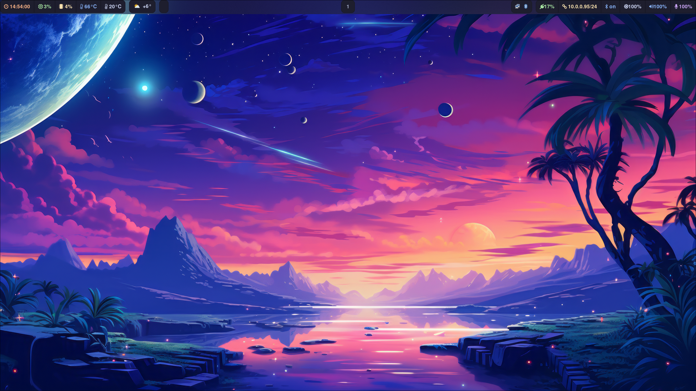
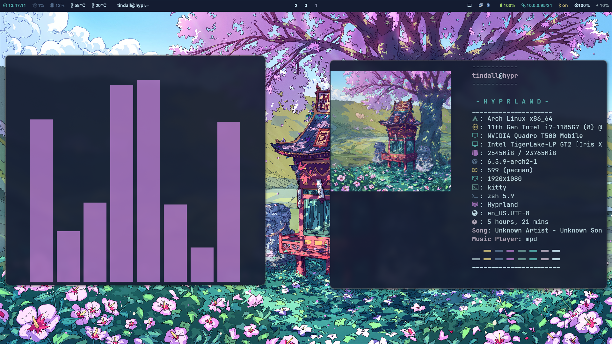
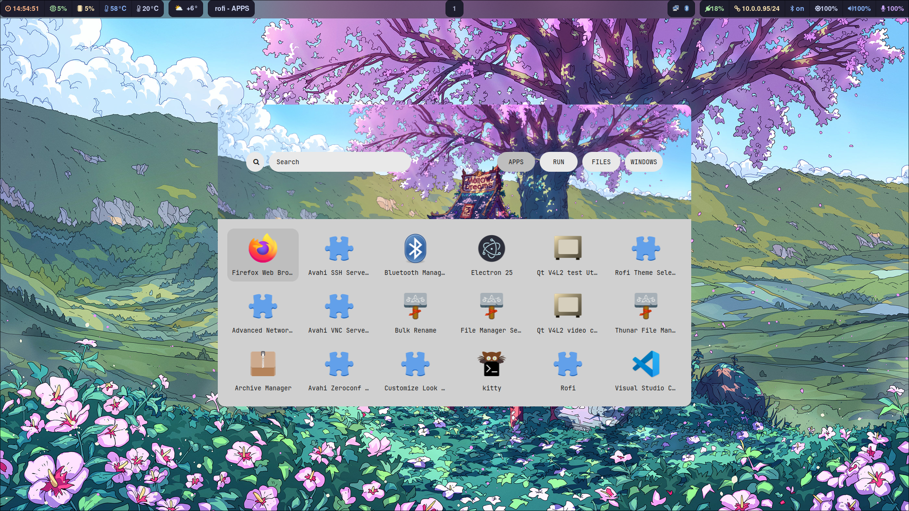
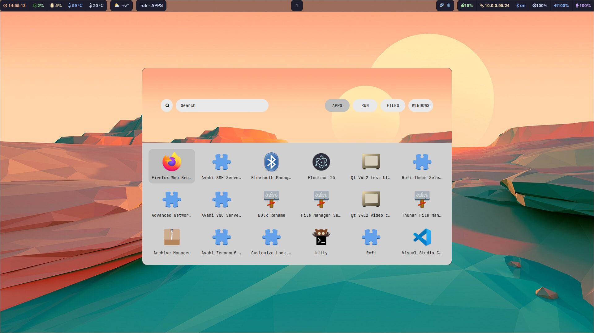
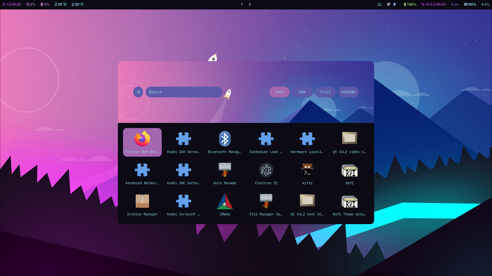

                                    Hyprland Dotfiles

<p align="center">
  
  
  
  
  </p>


**NOTE: Yay must be installed // Install script coming soon

```
git clone https://aur.archlinux.org/yay.git
cd yay
makepkg -si
```


### 🗄️ Dependencies 

```
yay -S hyprland-bin kitty waybar-hyprland \
    swaybg swaylock-effects rofi sddm-git wlogout mako thunar \
    ttf-jetbrains-mono-nerd thunar-archive-plugin file-roller noto-fonts-emoji \
    polkit-gnome python-requests swww starship \
    swappy grim slurp pamixer brightnessctl gvfs \
    bluez bluez-utils neofetch lxappearance xfce4-settings \
    dracula-gtk-theme dracula-icons-git xdg-desktop-portal-hyprland-git \
    python python-pyamdgpuinfo jq network-manager-applet blueman \
    oh-my-zsh-git zsh-autosuggestions zsh-synxtax-highlighting \
    zsh-theme-powerlevel10k-git eza wlogout
```

### 💻 Install

```
git clone https://github.com/T-Crypt/dots && cd dots
cp -R .configs/* ~/.config/
sudo systemctl enable sddm.service
sudo systemctl start sddm.service
```

<details> 
  <summary><h2>🏷️ Additional Packages </h2></summary>
<div class="box">
 <pre>
   <code>
     yay -S firefox visual-studio-code-bin 
   </code>
 </pre>


</details>

### 🐜 ScreenShots












### Changes to Make

You need to edit the wttr-in.py script to change city location

Current Location: Denver, CO

`.config/waybar/scripts/waybar-wttr.py`


<details> 
  <summary><h2> KeyBindings </h2></summary>

| Keys | Action |
| :--  | :-- |
| <kbd>Super</kbd> + <kbd>Q</kbd> | quit active/focused window
| <kbd>Super</kbd> + <kbd>W</kbd> | Change Wallpaper
| <kbd>Super</kbd> + <kbd>T</kbd> | launch kitty terminal
| <kbd>Super</kbd> + <kbd>E</kbd> | launch Thunar
| <kbd>Super</kbd> + <kbd>C</kbd> | launch vscode
| <kbd>Super</kbd> + <kbd>F</kbd> | launch firefox
| <kbd>Super</kbd> + <kbd>A</kbd> | launch desktop applications (rofi)
| <kbd>Super</kbd> + <kbd>L</kbd> | lock screen
| <kbd>Super</kbd> + <kbd>V</kbd> | Toggle Floating
| <kbd>Super</kbd> + <kbd>J</kbd> | Toggle Split
| <kbd>Super</kbd> + <kbd>S</kbd> | Print Screen Tool
| <kbd>Super</kbd> + <kbd>MouseScroll</kbd> | cycle through workspaces
| <kbd>Super</kbd> + <kbd>[0-9]</kbd> | switch to workspace [0-9]
| <kbd>Super</kbd> + <kbd>Shift</kbd> + <kbd>[0-9]</kbd> | move active window to workspace [0-9]

</details>
